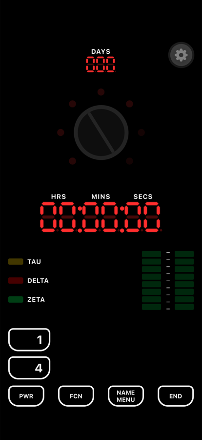

# Sliders Timer

Réplique logicielle du minuteur de la série *Sliders*, pour Android et iOS.

L'application n'imite pas l'objet de loin : elle rejoue la logique d'affichage
de la [réplique matérielle](https://github.com/kenny-caldieraro/Sliders-timer-replica)
construite autour d'un Arduino. Les deux matrices MAX7219 sont simulées en
mémoire, et les séquences d'animation sont les tables du firmware, portées
octet pour octet.



## Fonctionnement

| Bouton | Rôle |
|---|---|
| **PWR** | Allume et éteint le minuteur |
| **FCN** | Parcourt les champs à régler : secondes → minutes → heures → jours → sortie |
| **1** / **4** | Incrémente et décrémente le champ sélectionné |
| **END** | Lance le saut. Pendant un décompte, provoque un saut anticipé vers une durée tirée au sort |
| **NAME / MENU** | Force le saut et bascule en burnout |

Le potentiomètre se tourne au doigt et pilote l'arc de sept LED.

Sur la réplique matérielle, le burnout a son propre bouton. L'application n'a
que six touches, dont **NAME / MENU** qui ne servait à rien : elle garde la
sérigraphie du prop et déclenche le burnout.

### Burnout

Forcer le saut en plein décompte enclenche quatre-vingt-dix secondes de
sursis. Les paliers sonores s'enchaînent, les témoins passent au fixe l'un
après l'autre, et les bargraphes changent de table à trente et soixante
secondes. À la dernière seconde, **NAME / MENU** rattrape le coup et relance
un décompte tiré au sort. Sinon le vortex s'ouvre et le minuteur meurt : seul
**PWR** répond encore.

## Architecture

L'application est bâtie comme un jumeau logiciel du matériel.

```
src/
  hardware/     les deux matrices MAX7219 en mémoire : setRow, setLed, setDigit
  animations/   les tables du firmware + le lecteur de séquences
  audio/        l'oscillateur du buzzer et les clips de la carte SD
  timer/        la machine à états et ses pilotes
  components/   le rendu SVG des matrices
```

Trois choix structurent le reste.

**Les matrices sont la source de vérité de l'affichage.** Écrire une ligne ne
re-rend que l'afficheur concerné : chaque composant s'abonne à sa propre ligne
via `useSyncExternalStore`. Une animation à soixante images par seconde ne
traverse jamais le composant racine.

**L'échéance fait foi pendant le décompte.** `deadlineAt` est un instant
absolu ; le temps restant s'en déduit. Le décompte ne dérive pas et retrouve
la bonne valeur après un passage en arrière-plan.

**Le reducer est pur.** Aucun son, aucune animation, aucune minuterie n'est
déclenchée depuis le rendu. Les effets sont produits par des pilotes qui
observent les transitions d'état.

### Porter une animation depuis le firmware

Les tables de `src/animations/frames.ts` sont **générées**. Après une
modification du sketch Arduino :

```bash
python3 scripts/port-arduino-frames.py
npm test
```

Le script lit directement le `.ino` de la réplique et réécrit le fichier. Les
tests de `__tests__/frames.test.ts` vérifient que les tables n'ont pas été
tronquées ou décalées.

## Développement

Prérequis : Node 20+, et pour les builds natifs Xcode (iOS) ou Android Studio.

```bash
npm install
npm run ios          # compile et lance sur le simulateur
npm run android
npm test             # tests unitaires
npm run typecheck
npm run lint
```

Les dossiers `ios/` et `android/` ne sont pas versionnés : toute la
configuration native vit dans `app.config.ts` et se régénère avec
`npm run prebuild`.

## Publication

Les builds passent par EAS :

```bash
eas build --platform android --profile production
eas build --platform ios --profile production
eas submit --platform android --profile production
```

La clé de signature Android est gérée par **EAS Credentials**. Elle n'est
jamais dans le dépôt, et aucun mot de passe ne doit apparaître dans
`app.config.ts` ni dans un fichier suivi par git.

`android.package` doit rester `com.sliderstimer` : c'est l'identifiant de la
fiche Play existante.

## Licence

MIT. Voir `LICENSE`.

*Sliders* est une marque de ses ayants droit. Ce projet est un hommage de fan,
sans affiliation ni licence officielle.
